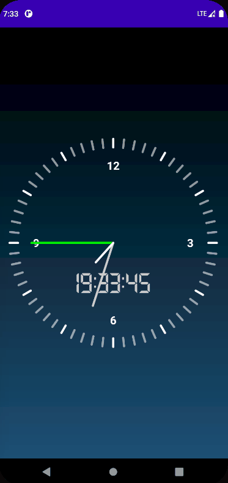

# CS175 Homework3: Complicated Component

Author: HUANG Siyuan (519030910095)

## Overview

Completed tasks:

+ Add minute needle
+ Make the clock function properly
+ Add hour values to the panel (Optional)
+ An additional digital clock (Optional)

Yet to finish:

+ Make the clock manually controllable (Optional)

The final outcome:

<p align="center">


## Implementation

**todo 1:** Add the minute needle to the dial.

```kotlin
// todo 2: 画分针
drawPointer(canvas, POINTER_TYPE_MINUTES, nowMinutes) 
```

**todo 2:** Get the clock moving.

The signal ```CLK_AUTO_REFRESH``` indicates that the dial will refresh on the basis of system time.

First I instantiate a handler to handle ``` CLK_AUTO_REFRESH```. If the signal is received, the dial will be refreshed.

```kotlin
private val refreshHandler: Handler = Handler(Looper.getMainLooper()) { msg ->
    when(msg.what){
        CLK_AUTO_REFRESH->this.invalidate()
    }
    true
}
```

Then in ```onDraw```, a message is sent every second, synchronized with the system time.

```kotlin
// todo 1: 每一秒刷新一次，让指针动起来
val msg = Message.obtain(refreshHandler, CLK_AUTO_REFRESH)
//refreshHandler.sendMessageDelayed(msg, 1000)
refreshHandler.sendMessageDelayed(msg, 1000 - System.currentTimeMillis() % 1000) 
// This ensures millisecond synchronization with system time
```

**todo 3:** Add hour values to the panel.

For text drawing, I instantiate a communal ```Paint``` called ```textPaint```.

I only draw 12, 3, 6, 9 on the dial to give it a clean look. Also I adopt the function ```getContentSize``` from tutorial to make sure the text is drawn exactly in the middle of the given position. ```hourValueRadius``` is the distance from hour value to the center of the dial.

```kotlin
private fun drawHoursValues(canvas: Canvas) {
    textPaint.textSize = 70f
    textPaint.color = Color.WHITE
    textPaint.typeface = Typeface.DEFAULT_BOLD
    for (i in 0..3){
        var hour = if (i == 0) {
            12
        } else {
            i * 3
        }
     	var degree = i * 15 * UNIT_DEGREE // every 90 degrees draw a number.
     	val (textWidth, textHeight) = getContentSize("$hour")
       	canvas.drawText("$hour",
           centerX.toFloat() + hourValueRadius * sin(degree),
           centerY.toFloat() - hourValueRadius * cos(degree) + textHeight / 2f ,
           textPaint )
    }
}
```

**todo 4:** A digital clock add-on.

I make such variables as ```nowHours``` originally in the function ```drawNeedles``` private variables in the class for time synchronization between the clock and the digital clock. ```currentTime``` is used to update the time.

```drawDigitalTimer``` is for drawing the digital clock. Also I use a customized font.

```kotlin
private fun drawDigitalTimer(canvas: Canvas){
    textPaint.typeface = Typeface.createFromAsset(context.assets, "fonts/Technology.ttf")
    textPaint.color = DEFAULT_SECONDARY_COLOR
    textPaint.textSize = 180f
    
    // if x < 10, draw 0x for uniformity
    val h = if(nowHours>9) "$nowHours" else "0$nowHours"
    val s = if(nowSeconds>9) "$nowSeconds" else "0$nowSeconds"
    val m = if(nowMinutes>9) "$nowMinutes" else "0$nowMinutes"
    
    canvas.drawText("$h:$m:$s", centerX.toFloat(), centerY + digitToCenter, textPaint)
}
```


The final optional task remains unfinished for lack of time. Hopefully I can make it up afterwards.

