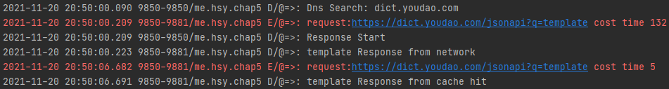

# CS175 Homework 4: Network

*NOT FINISHED*

CS175 Homework 4 Network. A translation app.

Author: HUANG Siyuan (519030910095)

## Overview

The app uses the api ```https://dict.youdao.com/jsonapi?q=word```. I've finished the following tasks:

+ **Basic UI, with a input box, a button to send request and a result display panel.**

+ **Chinese-English and English-Chinese translation, with pronunciation and additional associative phrases (if available).**

  Every returned explanation entry is put into the template ```ItemTemplate``` and dynamically added into the view.

+ **Use *WireShark* to grasp the request package. **

  The result can be seen in [./demo/wireshark_pkgs.pcapng](demo/wireshark_pkgs.pcapng), with all the DNS, TCP and TLS packages. We can conclude that the IP address of the client is 192.168.1.101, the DNS server is 202.120.2.101, and the server is 123.123.219.79.

+ **Cache for repeated requests**

  With the interceptor ```NetCacheInterceptor```, the app can now use cached data for duplicated requests. As is shown below, I look up the word *template* twice in a row, and the time taken for the second request is significantly reduced.

  <p align="center">
  

Underway:

+ **Traffic statistics**

## Demo

Chinese-English and English-Chinese translation, with pronunciation and additional associative phrases (if available). If no explanations are available, an error will be thrown.

<p align="center">


