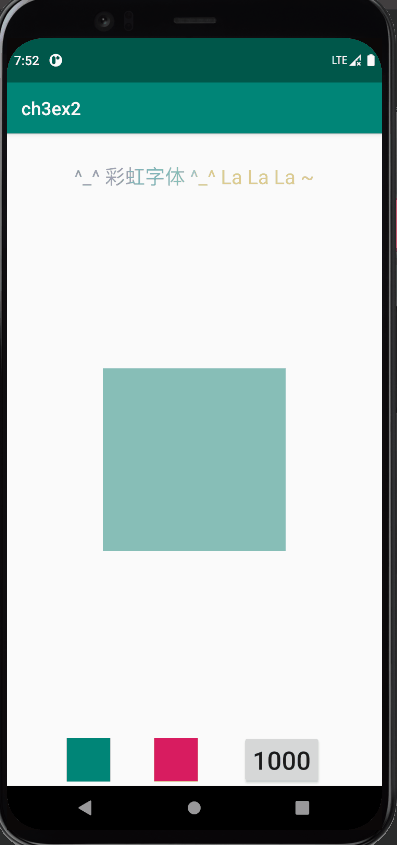

# CS175 Homework2: UI
Author: Huang Siyuan

## EX1

**ex1-1**: complete the attributes of Lottie widget.

The following attributes need to be added.

```xml
app:lottie_rawRes="@raw/material_wave_loading"
app:lottie_loop="true"
```

**ex1-2**: complete *onProgressChanged* by calling the proper function.

```java
if (fromUser) {
	animationView.setProgress(progress / 100.f);
    //progress:[0,100], required:[0.,1.]. Progress needs to be divided by 100f.
}
```
<p align="center">


## EX2

**ex2-1**: implement another *ObjectAnimator* that changes the scale of the target, looping between 1 and 2.

```java
//scaleX
ObjectAnimator animator2 = ObjectAnimator.ofFloat(target, "scaleX",1f, 2f);
animator2.setRepeatCount(ObjectAnimator.INFINITE);
animator2.setRepeatMode(ObjectAnimator.REVERSE);
animator2.setDuration(2000);
//scaleY
ObjectAnimator animator3 = ObjectAnimator.ofFloat(target, "scaleY",1f, 2f);
animator3.setRepeatCount(ObjectAnimator.INFINITE);
animator3.setRepeatMode(ObjectAnimator.REVERSE);
animator3.setDuration(2000);
```

**ex2-2**: implement another *ObjectAnimator* that changes the transparency of the target, looping between 1 and 0.5f.

```java
ObjectAnimator animator4 = ObjectAnimator.ofFloat(target, "alpha",1f, 0.5f);
animator4.setRepeatMode(ObjectAnimator.REVERSE);
animator4.setRepeatCount(ObjectAnimator.INFINITE);
animator4.setDuration(2000);
```

**ex2-3**: add all of the animators into *AnimatorSet* and start them simultaneously.

```java
animatorSet = new AnimatorSet();
animatorSet.playTogether(animator1, animator2, animator3, animator4);
animatorSet.start();
```

**TODO-X**: make the rainbow view visible

```xml
android:visibility="visible"
```
<p align="center">

	
**Q**: Why use *ofArgb* instead of *ofInt* here?

```
ObjectAnimator animator1 = ObjectAnimator.ofArgb(target,
                "backgroundColor",
                getBackgroundColor(startColorPicker),
                getBackgroundColor(endColorPicker));
```
It's because this part intends to change the color,  i.e. the RGB value of the target.


## EX3

Here‘s the DEMO:

<p align="center">

	
**ex3-1**: *ViewPager* and scrollable panel with *Fragment*

```java
private String[] titles = new String[]{"Friend List1", "Friend List2", "Friend List3"};
...
viewPager = (ViewPager) findViewById(R.id.view_pager);
for (int i = 0; i < titles.length; i++) {
//instantiate fragments
fragments.add(PlaceholderFragment.newInstance(titles[i]));
}
viewPager.setAdapter(new FragmentPagerAdapter(getSupportFragmentManager()){
@Override
public int getCount() {
	return fragments.size();
}
@Override
public Fragment getItem(int i) {
	return fragments.get(i);
}
@Nullable
@Override
public CharSequence getPageTitle(int position) {
	return titles[position];
}//essential, otherwise the tags' text will be invisible
});
```

**ex3-2**: *TabLayout*

```java
tabLayout = (TabLayout) findViewById(R.id.tab_layout);
//fill the tags
for (int i = 0; i < titles.length; i++){
	tabLayout.addTab(tabLayout.newTab().setText(titles[i]));
}
tabLayout.setupWithViewPager(viewPager,false);
```

Modification in the layout file:

```xml
<android.support.design.widget.TabLayout
        android:id="@+id/tab_layout"
        android:layout_width="match_parent"
        android:layout_height="wrap_content"
        app:tabIndicatorColor="#673AB7"
        app:tabTextColor="#717171"
        app:tabSelectedTextColor="#000000"
        />
<android.support.v4.view.ViewPager
        android:id="@+id/view_pager"
        android:layout_width="match_parent"
        android:layout_height="wrap_content"
        />
```

**ex3-3**: modification of *fragment_placeholder*

```xml
<com.airbnb.lottie.LottieAnimationView
        android:id="@+id/lottie_view"
        android:layout_width="100dp"
        android:layout_height="100dp"
        android:layout_gravity="center"
        app:lottie_rawRes="@raw/material_wave_loading"
        app:lottie_autoPlay="true"
        app:lottie_loop="true"
        app:lottie_repeatMode="reverse" />
<ListView
        android:id = "@+id/list_view"
        android:layout_width="match_parent"
        android:layout_height="match_parent"/>
```

*onCreateView*:

```java
//must locate the views here.
View rootView =  inflater.inflate(R.layout.fragment_placeholder, container, false);
animationView = rootView.findViewById(R.id.lottie_view);
listView = rootView.findViewById(R.id.list_view);
```

The loading animation:

```java
//loading anim fades
ObjectAnimator animator1 = ObjectAnimator.ofFloat(animationView,"alpha",1,0f);
animator1.setInterpolator(new LinearInterpolator());
animator1.setDuration(500);

//generate the list of friends
String title = getArguments().getString("title");
String[] friends = new String[]{"People1", "People2", "People3", "People4", "People5", "People6"};
for (int i = 0; i < friends.length; i++){
	friends[i] = title +"-"+ friends[i];//title is the tag's title, to dscriminate different fragments.
}
//appear
ListAdapter listAdapter = new ArrayAdapter(requireContext(), android.R.layout.simple_list_item_1, friends);
listView.setAdapter(listAdapter);

ObjectAnimator animator2 = ObjectAnimator.ofFloat(listView,"alpha",0,1f);
animator2.setInterpolator(new LinearInterpolator());
animator2.setDuration(500);

animatorSet = new AnimatorSet();
animatorSet.playTogether(animator1,animator2);
animatorSet.start();
```

