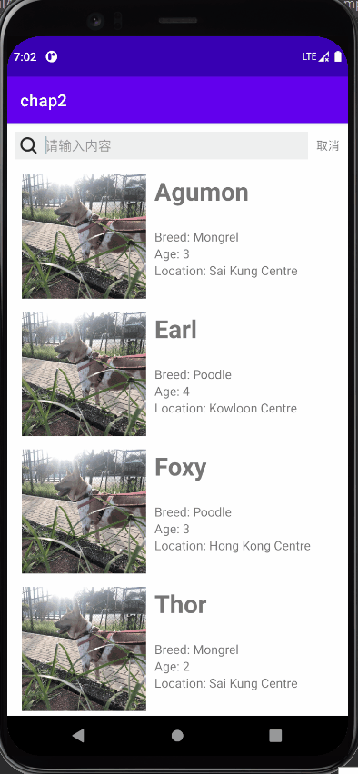

# CS175 Homework 4: Network

*NOT FINISHED*

CS175 Homework 4 Network. A translation app.

Author: HUANG Siyuan (519030910095)

## Overview

Finished tasks:

+ Basic UI, with a input box, a button to send request and a result display panel.
+ Chinese-English and English-Chinese translation, and additional associative phrases.

TODO:

+ Use *WireShark* or *Charles* to grasp the request package
+ Cache
+ Flow statistics

## Demo

